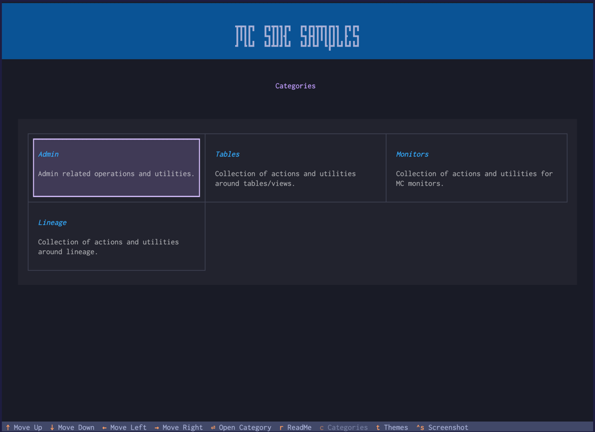
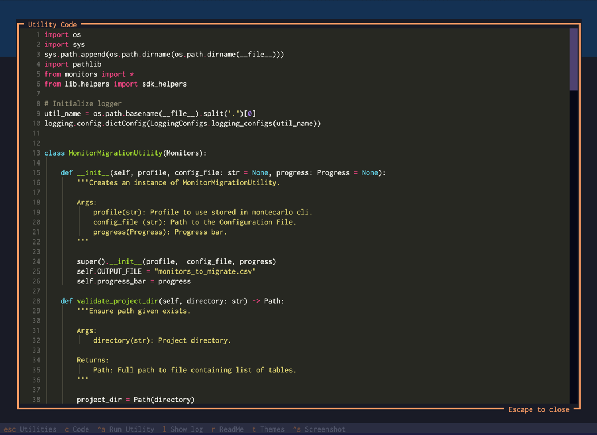
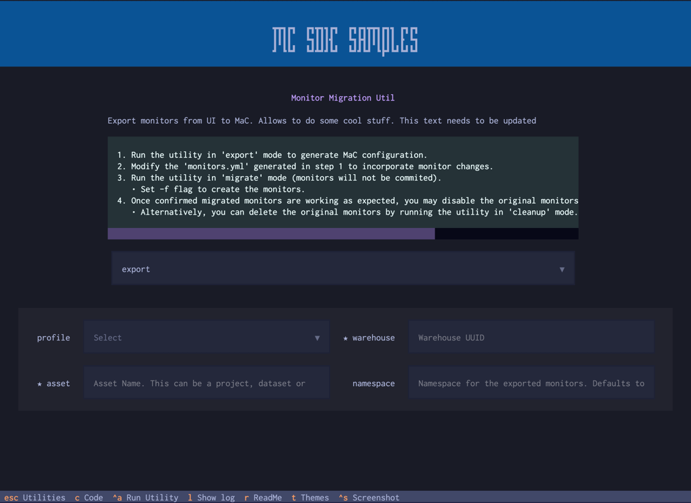

<div id="top"></div>
<a href=""></a>

# Monte Carlo Python SDK Examples

These examples use [Pycarlo](https://github.com/monte-carlo-data/python-sdk), Monte Carlo's Python SDK and the Monte Carlo's [CLI](https://pypi.org/project/montecarlodata/).

<!-- TABLE OF CONTENTS -->
- [Utility Setup](#utility-setup)
- [Quick Start](#quick-start)
  - [MC SDK Samples App](#1-mc-sdk-samples-app)
  - [MC SDK Sample Runner](#2-mc-sdk-sample-runner-wrapper)
  - [Standalone Scripts](#3-standalone-script)

## Utility Setup
Some of the scripts in this repository may be called from the CLI app, utility wrapper runner or as standalone scripts. 
1. Navigate to a desired directory where the repository will reside
2. Clone or download the git repository
   ```bash
   git clone https://github.com/monte-carlo-data/monte-carlo-python-sdk-examples.git
   ```
3. You can choose from an existing or new virtual environment or use the base python installation as the interpreter. 
In either case, make sure to use python3.12 as the base interpreter
4. Install all python modules:
   ```bash
   python -m pip install -r requirements.txt
   ```
<p align="right">(<a href="#top">back to top</a>)</p>

## Quick Start

### 1. MC SDK Samples App

App with a nice looking interface to run scripts from the terminal. If you are not too familiar with python and command utilities in general this option is best suited for you. To launch the app, execute the command below:

```bash
python -m app
```

  
 
**Note:** The navigation keys will be shown in the footer.

<p align="right">(<a href="#top">back to top</a>)</p>

### 2. MC SDK Sample Runner (Wrapper)

CLI that collects different types of utilities into commands and subcommands. Use the ```--help/-h``` flag for details on the commands/utilities available.

```bash
python mcsdksamplerunner.py -h
```

If the Monte Carlo CLI has not been configured before, running any utility will prompt for Monte Carlo credentials to 
generate new tokens. This only applies for accounts not using SSO. 

### Example:

```bash
(venv) python3.12 mcsdksamplerunner.py  monitors bulk-set-freshness-sensitivity -p demo -i /Users/hjarrin/Downloads/freshness_thresholds_auto.csv -w aaaa7777-7777-a7a7-a7a7a-aaaa7777

                    
            ███╗   ███╗ ██████╗ ███╗   ██╗████████╗███████╗     ██████╗ █████╗ ██████╗ ██╗      ██████╗ 
            ████╗ ████║██╔═══██╗████╗  ██║╚══██╔══╝██╔════╝    ██╔════╝██╔══██╗██╔══██╗██║     ██╔═══██╗
            ██╔████╔██║██║   ██║██╔██╗ ██║   ██║   █████╗      ██║     ███████║██████╔╝██║     ██║   ██║
            ██║╚██╔╝██║██║   ██║██║╚██╗██║   ██║   ██╔══╝      ██║     ██╔══██║██╔══██╗██║     ██║   ██║
            ██║ ╚═╝ ██║╚██████╔╝██║ ╚████║   ██║   ███████╗    ╚██████╗██║  ██║██║  ██║███████╗╚██████╔╝
            ╚═╝     ╚═╝ ╚═════╝ ╚═╝  ╚═══╝   ╚═╝   ╚══════╝     ╚═════╝╚═╝  ╚═╝╚═╝  ╚═╝╚══════╝ ╚═════╝ 
                                                                                                         
        
2024-08-13 16:15:28 INFO - running utility using 'demo' profile
2024-08-13 16:15:28 INFO - checking montecarlo test version...
2024-08-13 16:15:28 INFO - montecarlo test present
2024-08-13 16:15:28 INFO - validating montecarlo test connection...
2024-08-13 16:15:29 ERROR - unable to validate token
2024-08-13 16:15:29 INFO - creating new token
MC Username: testuser@testdomain.com
MC Password: 
2024-08-13 16:15:46 INFO - token stored successfully
2024-08-13 16:15:46 INFO - starting input file validation...
2024-08-13 16:15:46 INFO - updating freshness rules...
2024-08-13 16:15:48 INFO - freshness threshold updated successfully for table hxe:dev_schema.offer
2024-08-13 16:15:49 INFO - freshness threshold updated successfully for table hxe:dev_schema.subscription
2024-08-13 16:15:49 INFO - freshness threshold updated successfully for table hxe:dev_schema.zuora_invoice
[COMPLETE] ━━━━━━━━━━━━━━━━━━━━━━━━━━━━━━━━━━━━━━━━ 100% 0:00:00
```

**Note:** If your account is using SSO, generate the token manually from the UI and store them in ```~/.mcd/profiles.ini
``` or run the ```montecarlo configure``` command by following the onscreen prompts.

<p align="right">(<a href="#top">back to top</a>)</p>

### 3. Standalone Script

Scripts are organized into different folders depending on its functionality. You still have the option to run a given python file as a regular script. For example:

```bash
python monitors/monitor_migration_util.py -h
```

or

```bash
cd monitors
python monitor_migration_util.py -h
```

<p align="right">(<a href="#top">back to top</a>)</p>